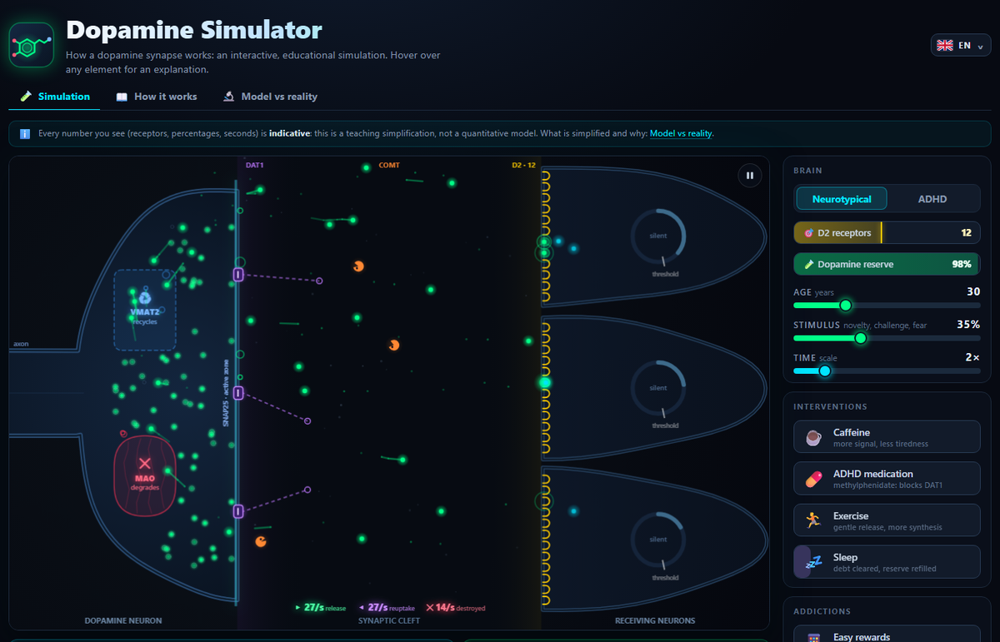

# Dopamine Simulator

An interactive, educational simulation of a dopamine synapse. Watch dopamine get released, bind its receptors, get pulled back, recycled or destroyed, and see how a neurotypical and an ADHD synapse differ. Then play with sleep, caffeine, medication, exercise, easy rewards and substances.

**Try it:** https://stefanocaronia.github.io/dopamine-simulator/



## What you can do
- Switch brain (neurotypical or ADHD), age, stimulus and time scale
- Interventions: caffeine, ADHD medication, exercise, sleep
- Addictions: easy rewards (scrolling, gaming, gambling…), nicotine, cannabis, alcohol, cocaine, each with its after-effect and its cost in receptors
- Watch the neuron fire: a tonic pacemaker and phasic bursts travel down the axon, light up the terminal and release dopamine in packets
- Read what is happening: live state cards under the canvas and a tooltip on every element
- Two more pages: **How it works** (short sections, infographics, glossary) and **Model vs reality** (what is simplified and why)
- Kids mode (🧒 in the header, or `?kid=1` in a shared link): no substances, kid-friendly examples, age starting at 12
- Eleven languages, remembered settings, no account, no tracking

## Run it locally
Open `index.html` in a browser, or serve the folder with any static server:

```bash
python -m http.server 8080
```

No build step, no dependencies: plain HTML, CSS and JavaScript.

## A teaching model, not a quantitative one
Every number is chosen to be visible, not measured. What the model does and what the literature says, element by element, is in the app under *Model vs reality* and, with references, in [docs/fedelta-biologica.md](docs/fedelta-biologica.md) (Italian). Corrections from biologists are welcome: open an issue.

## Contributing
[docs/DEVELOPMENT.md](docs/DEVELOPMENT.md) covers the architecture, the model parameters, how to test, how to add a language and what is still open. Italian is the source language; the other ten are machine-assisted translations and native review is welcome.

## License
[MIT](LICENSE) © 2026 Stefano Caronia. Use it, modify it, embed it: just keep the copyright notice.
